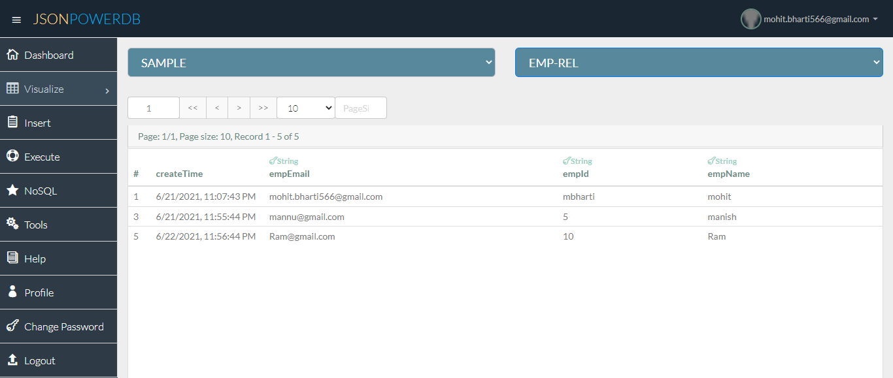

# JsonPowerDB 

## "This project is all about basics of JsonPowerDB (JPDB) " 
### About JsonPowerDB:

- JsonPowerDB is a Database Server with Developer friendly REST API services. It's a High Performance, Light Weight, Ajax Enabled, Serverless, Simple to Use, Real-time Database.

- Easy and fast to develop database applications without using any server side programming / scripting or without installing any kind of database.

- Whether it's a Dynamic Website or a Mobile App or some Data Analytics Portal, the development is real fun and fast. Nothing better than trying it yourself. What all you need is a basic understanding of HTML, CSS, Bootstrap, and Javascript.

### Why Prefer JsonPowerDB

- Minimum Development Cost
- Minumum Time to Market
- Minimise the complexity of interoperability of different Applications
- Maximum Data processing Performance
- Minimize Total Cost of Ownership

### Use Cases - All Dynamic Web Applications

- All Mobile applications that require backend database.
- Session Caching.
- Page Caching.
- Existing Database applications to improve their reporting / analytics performance.
- Best suited as backend Database for IoT.
- Live HTML templates / themes.
- Any software application that needs backend database.

### Benefits of using JsonPowerDB

- Simplest way to retrieve data in a JSON format.
- Schema-free, Simple to use, Nimble and In-Memory database.
- It is built on top of one of the fastest and real-time data indexing engine - PowerIndeX.
- It is low level (raw) form of data and is also human readable.
- It helps developers in faster coding, in-turn reduces development cost.

###screenshots
---
1.

2.

3.

4.

